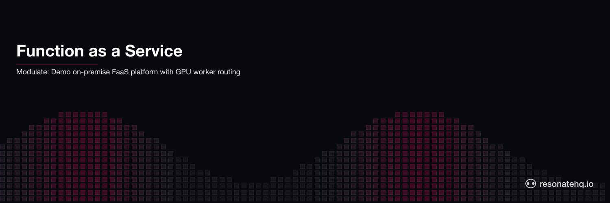

<p align="center">
  <picture>
    <source media="(prefers-color-scheme: dark)" srcset="./assets/banner-dark.png">
    <source media="(prefers-color-scheme: light)" srcset="./assets/banner-light.png">
    
  </picture>
</p>

# Modulate: On-Premise FaaS Platform with Resonate

**A demo Function-as-a-Service platform demonstrating how to build infrastructure with Resonate.**

Modulate shows how to use Resonate to build a distributed FaaS platform that routes workloads to specialized workers (like GPU nodes) with automatic crash recovery and durable execution.

## Why Build an On-Premise FaaS Platform?

Function-as-a-Service (FaaS) is a cloud computing model that lets developers deploy individual pieces of code—called functions—without managing servers or infrastructure. These functions are triggered by specific events, like an HTTP request, a file upload, or a database update. The cloud provider (e.g., AWS Lambda, Azure Functions) automatically handles scaling, resource allocation, and runtime environments. You pay only for the compute time your functions consume, in millisecond increments.

The "serverless" nature of FaaS means developers focus purely on writing code to solve problems, while the provider abstracts away servers, virtual machines, and containers. However, "serverless" doesn't mean there are no servers—it means you don't see or manage them.

### Why On-Premise?

Building an on-premise FaaS platform might seem counterintuitive, but it offers unique benefits:

- **GPU and AI Workloads** - Direct access to specialized hardware
- **Data Privacy** - Sensitive data never leaves your infrastructure
- **Cost Predictability** - No per-invocation charges, fixed infrastructure costs
- **Compliance** - Meet regulatory requirements for data locality
- **Custom Hardware** - Leverage proprietary accelerators or specialized chips

## Why Resonate?

Resonate is designed to make distributed systems as straightforward as writing `async/await` code. This makes it ideal for building an on-prem FaaS platform:

- **Distributed Async/Await** - Write functions as simple `async/await` code while Resonate guarantees crash-resistant execution
- **Routing** - Tasks are directed to the right workers seamlessly based on user input or defined criteria
- **Durability** - Automatic retries and built-in replayability ensure functions survive hardware failures and network issues

These features make Resonate an excellent choice for building a FaaS platform, especially for on-premise use cases where control, security, and cost predictability are critical.

## Architecture

```
┌─────────────┐
│   Client    │ Submit function execution
│  (modulate) │
└──────┬──────┘
       │
       ▼
┌─────────────┐
│  Resonate   │ Durable message router
│   Server    │ - Holds durable promises
└──────┬──────┘ - Routes tasks to worker groups
       │
       ├──────────────┐
       ▼              ▼
┌─────────────┐  ┌─────────────┐
│   worker    │  │   worker    │
│   (GPU)     │  │   (CPU)     │
└─────────────┘  └─────────────┘
  Execute code    Execute code
```

**Components:**

1. **CLI (modulate.py)** - Submits scripts to the Resonate server, which routes them to workers
2. **Workers (worker.py)** - Execute user functions in specialized groups (GPU, CPU, etc.)
3. **Resonate Server** - Coordinates message passing and provides durability

## What This Demonstrates

- **Task Routing** - Directing work to specific worker groups (GPU vs CPU)
- **RPC (Remote Function Call)** - Blocking calls that wait for results
- **Detached Execution** - Background tasks that don't block the caller
- **Worker Groups** - Organizing workers by capability (GPU, CPU)

## Prerequisites

- Python 3.12+
- uv (Python package manager)
- Resonate server running

## Installation

```bash
# Install dependencies
uv sync
```

## Running the Platform

### 1. Start Resonate Server

```bash
resonate dev
```

### 2. Start Worker(s)

In a separate terminal, start a GPU worker:

```bash
uv run python worker.py
```

To add a CPU worker (optional), start another instance in a separate terminal.

## Usage

### Submit a Function for Execution

**Wait for result (blocks until complete):**
```bash
uv run python modulate.py --id task-001 hello.py
```

**Fire-and-forget (returns immediately):**
```bash
uv run python modulate.py --id task-002 --no-wait hello.py
```

If `--id` is omitted a random uuid is used; print the id and pass it to `--get` later.

### Check Execution Status

```bash
uv run python modulate.py --get task-002
```

Returns the result filename if execution completed, or a "not ready" message if still running.

## Example Function

Create a Python script (`hello.py`):

```python
# hello.py
print("Hello from Modulate FaaS!")

# Simulate GPU work
import time
time.sleep(2)

result = {"message": "Computation complete", "status": "success"}
print(f"Result: {result}")
```

Submit it:
```bash
uv run python modulate.py --id gpu-job-1 hello.py
```

## How It Works

### 1. Function Submission

`modulate.py` reads your script and submits it as a durable Resonate promise routed to the target worker group:

```python
async def prep_execute(ctx: Context, job_id: str, script: str, machine_type: str, wait: bool):
    with open(script) as f:
        content = f.read()

    if wait:
        # RPC: block until the worker returns
        result = await ctx.options(target=machine_type).rpc("execute", content, job_id)
        return result
    else:
        # Detached: fire-and-forget background execution
        await ctx.detached("detached_rfi", content, job_id, machine_type)
        return None
```

### 2. Function Execution (Worker)

`worker.py` — workers in the `"gpu"` group pick up tasks and execute them:

```python
async def execute(ctx: Context, script_content: str, script_id: str) -> str:
    # runs the script in a sandboxed subprocess
    ...
    return output_filename
```

### 3. Result Retrieval

`modulate.py --get <id>` looks up the durable promise by its stable id:

```python
record = await resonate.promises.get(f"execution-{args.get_id}")
if record.state == "resolved":
    print(f"Job results located at: {record.value.data}")
```

## Key Concepts

### Worker Groups

Workers register with a specific group (`gpu`, `cpu`, etc.). The router directs tasks to groups using `ctx.options(target="gpu").rpc(...)`.

This enables:
- GPU-intensive workloads → GPU workers
- CPU-bound tasks → CPU workers
- Custom hardware → Specialized worker groups

### RPC vs Detached

- **RPC** - `ctx.rpc()` - Dispatches to a remote worker and awaits the result
- **Detached** - `ctx.detached()` - Fire-and-forget; the caller returns immediately

### Crash Recovery

If a worker crashes mid-execution, Resonate automatically:
1. Detects the failure
2. Retries the function on another worker in the same group
3. Ensures exactly-once execution semantics

## Production Considerations

For production use:

1. **Resource Limits** - Add CPU/memory limits to prevent resource exhaustion
2. **Isolation** - Use containers or VMs to isolate function execution
3. **Security** - Validate and sanitize uploaded code
4. **Monitoring** - Track execution times, failure rates, resource usage
5. **Scaling** - Add more workers dynamically based on queue depth
6. **Authentication** - Add auth for function submission
7. **Rate Limiting** - Prevent abuse with request limits

## Use Cases

This pattern applies to:

- **ML Model Inference** - Route requests to GPU workers for inference
- **Video Processing** - Leverage GPU acceleration for transcoding
- **Scientific Computing** - Distribute workloads across HPC clusters
- **Data Processing** - Route jobs to workers with specific capabilities
- **Edge Computing** - Deploy workers close to data sources

## Learn More

- [Resonate Python SDK Docs](https://docs.resonatehq.io/sdk/python)
- [Task Routing Patterns](https://docs.resonatehq.io/patterns/routing)

## Related Examples

- [example-load-balancing-py](../example-load-balancing-py) - Worker pool patterns
- [example-async-rpc-py](../example-async-rpc-py) - Cross-process communication
- [example-kafka-worker-py](../example-kafka-worker-py) - Message queue workers
